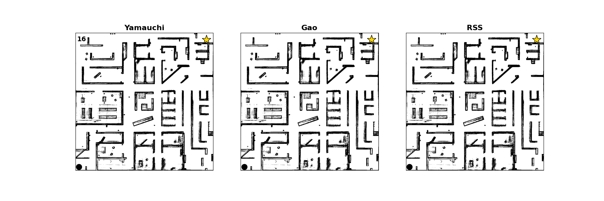
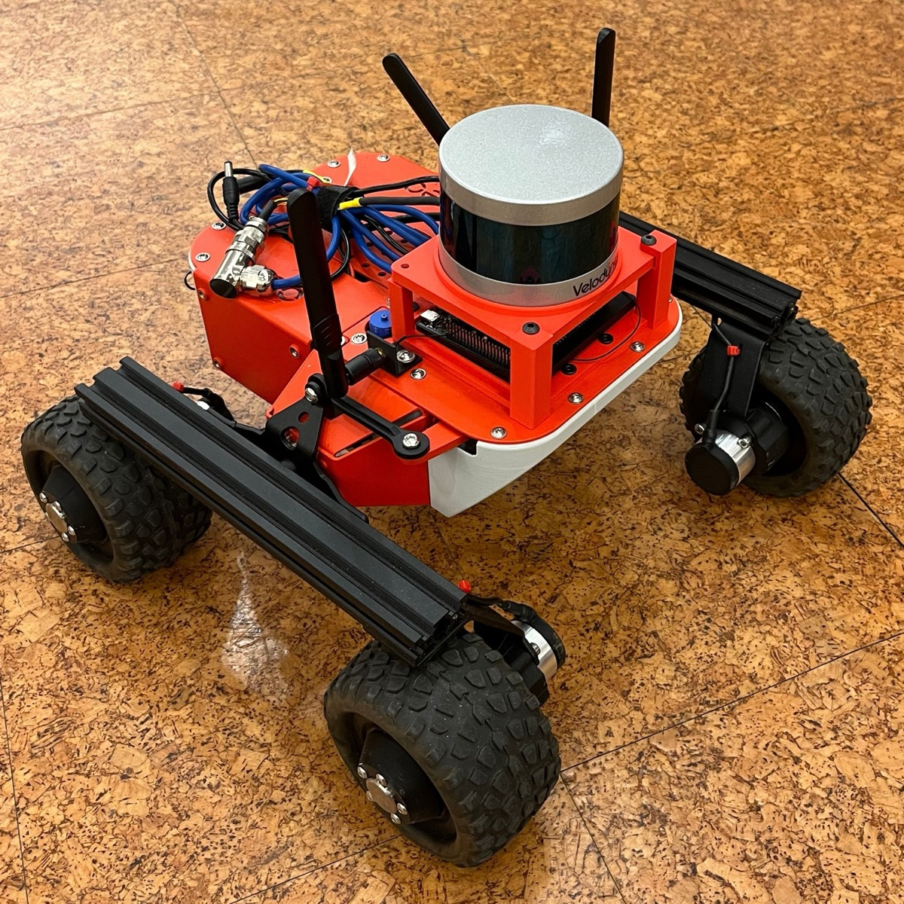

# Not All Frontiers Are Equal
### Comparing Frontier Selection Strategies Using the Leo Rover


An autonomous mobile robot that explores unknown environments using frontier-based exploration, guided by WiFi signal strength to locate a signal source. Three frontier selection strategies are implemented and compared: **Yamauchi** (nearest frontier), **Gao** (heading-weighted), and **RSS-guided** (signal-aware). Built on ROS2, Nav2, and SLAM Toolbox, and evaluated in both simulation and on a physical Leo Rover platform.

The full thesis is available [here](link_to_thesis).

---

## Exploration in Action

Three runs per strategy, same starting conditions. The filled circle is the start position, the star is the signal source.

| Yamauchi | Gao | RSS |
|:---:|:---:|:---:|
|  |  |  |

---

## The Robot



Leo Rover 1.8 with a Velodyne VLP-16 LiDAR and Jetson Orin Nano 8GB for onboard compute. A TP-Link router serves as the WiFi signal source.

---

## Dependencies

- ROS2 Foxy
- Nav2
- SLAM Toolbox
- Gazebo Classic
- `ros1_bridge` (for physical robot only)
- `velodyne` ROS2 driver (for physical robot only)

---

## Install

```bash
git clone https://github.com/lukasderia/ros2_leo_ws
cd ros2_leo_ws
colcon build
source install/setup.bash
```

---

## Run

### Simulation

```bash
ros2 launch leo_bringup laptop_sim.launch.py
```

### Physical Robot

On the Jetson:
```bash
ros2 launch leo_bringup jetson_full_exp.launch.py
```

On the laptop:
```bash
ros2 launch leo_bringup laptop_full.launch.py
```

Exploration mode is set as a launch parameter: `0` = Yamauchi, `1` = Gao, `2` = RSS.

---

## Package Structure

```
src/
├── leo_bringup/       # Master launch files for sim and physical robot
├── leo_description/   # URDF robot model
├── leo_exploration/   # Frontier detection, selection strategies, RSS node
├── leo_gazebo/        # Simulation world
├── leo_nav2/          # Nav2 configuration
├── leo_slam/          # SLAM Toolbox configuration
├── leo_teleop/        # Gamepad teleoperation
├── leo_utils/         # Data recording and analysis scripts
└── leo_velodyne/      # Velodyne LiDAR driver configuration
```

---

*Master's thesis — Department of Technology Systems, University of Oslo, Spring 2026*  
*Lukas Deria Lewe Düzakin, supervised by Tønnes Nygaard*
