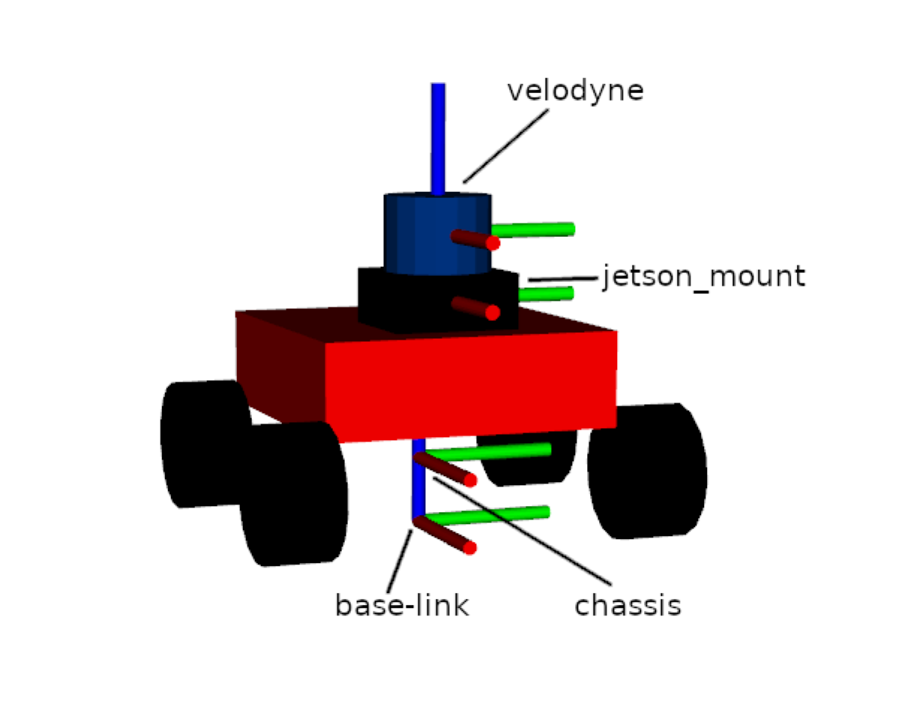

# Not All Frontiers Are Equal
### Comparing Frontier Selection Strategies Using the Leo Rover


---

## About

This is my master's thesis project, completing my degree in Cybernetics and Autonomous Systems at the University of Oslo. The project compares three frontier-based exploration strategies for autonomous robot exploration in unknown environments, with the goal of locating a WiFi router as a stand-in for a radio signal source in search and rescue scenarios.

The robot uses SLAM Toolbox to map and localise itself, and Nav2 to navigate. The three strategies differ only in how they decide which frontier to explore next:

- **Yamauchi (1997)** — always go to the nearest frontier
- **Gao (2018)** — prefer frontiers aligned with the robot's current heading
- **RSS-guided (inspired by Twigg, 2012)** — use WiFi signal strength to bias exploration toward the source

I performed a comparative study across 72 simulation runs per strategy and validated the findings on a physical robot platform. The full thesis is available [here](link_to_thesis).

---

## Exploration in Action

The animations below show three runs per strategy under the same starting conditions. The filled circle is the start position, the star is the signal source. Notice how RSS consistently moves toward the target while the baselines explore without directional bias.


---

## The Robot

<p align="center">
  
  &nbsp;&nbsp;&nbsp;
  
</p>

The platform is a **Leo Rover 1.8** extended with:
- **Velodyne VLP-16** LiDAR as the primary sensor for SLAM
- **Jetson Orin Nano 8GB** as the onboard compute unit, running ROS2 Foxy
- **Alfa AWUS036ACS** USB WiFi adapter for ROS2 communication
- Built-in **RTL8822CE** WiFi card for RSS signal measurement
- **TP-Link WR840N** router as the signal source

---

## Software Stack and Dependencies

The system runs entirely on **Ubuntu 20.04** with **ROS2 Foxy**. The simulation can be run on any machine meeting these requirements. Physical robot deployment additionally requires a Raspberry Pi 4 running ROS1 (LeoOS), bridged to ROS2 via the `ros1_bridge` package.

**Required for simulation:**
- ROS2 Foxy
- Nav2
- SLAM Toolbox
- Gazebo Classic

**Additional requirements for physical robot:**
- ROS1 Noetic (on the Leo Rover's Raspberry Pi)
- `ros1_bridge` (bridging odometry and velocity commands between ROS1 and ROS2)
- Velodyne ROS2 driver

The physical setup involves two separate ROS environments — one on the Jetson running ROS2, one on the rover's Raspberry Pi running ROS1 — communicating over the rover's WiFi hotspot. Setting this up is hardware-dependent and described in detail in the thesis.

---

## Package Structure

```
src/
├── leo_bringup/       # Master launch files for sim and physical robot
├── leo_description/   # URDF robot model
├── leo_exploration/   # Frontier detection, selection strategies, RSS node
├── leo_gazebo/        # Simulation world
├── leo_nav2/          # Nav2 configuration
├── leo_slam/          # SLAM Toolbox configuration
├── leo_teleop/        # Gamepad teleoperation
├── leo_utils/         # Data recording and analysis scripts
└── leo_velodyne/      # Velodyne LiDAR driver configuration
```

The core exploration logic lives in `leo_exploration/src/`:
- `frontier_detector.cpp` — detects and clusters frontier cells from the occupancy map
- `frontier_explorer.cpp` — scores and selects frontiers according to the active strategy
- `rss.cpp` / `rss_sim.cpp` — measures WiFi signal strength and estimates the gradient direction

---

## Install and Run (Simulation)

```bash
git clone https://github.com/lukasderia/ros2_leo_ws
cd ros2_leo_ws
colcon build
source install/setup.bash
```

Launch the full simulation stack:

```bash
ros2 launch leo_bringup laptop_sim.launch.py
```

This starts Gazebo, SLAM Toolbox, Nav2, and the exploration node. The exploration mode is set as a launch argument:

```bash
ros2 launch leo_bringup laptop_sim.launch.py mode:=0  # Yamauchi
ros2 launch leo_bringup laptop_sim.launch.py mode:=1  # Gao
ros2 launch leo_bringup laptop_sim.launch.py mode:=2  # RSS
```

---

*Master's thesis — Department of Technology Systems, University of Oslo, Spring 2026*  
*Lukas Deria Lewe Düzakin, supervised by Tønnes Nygaard*
